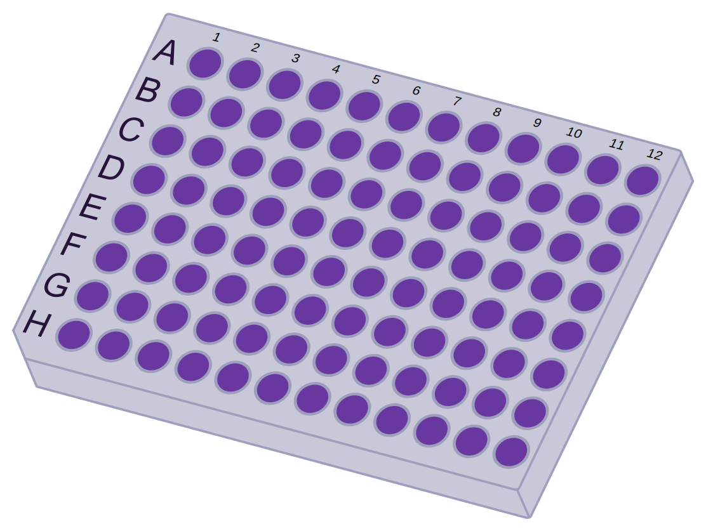

# Freezuh, Final Transformation

## Description
Freezuh, Final Transformation (hereby referred to as Freezuh), is a web application designed for biospecimen storage and retrieval for a biotech company. Most (all?) biotech companies start tracking samples on spreadsheets which leads to lost materials, potential material thaws, and increased freezer motor strain from manual searching. To help aid research for human disease and ailments, Freezuh will always be free-of-charge under the MIT license.

Due to the high-volume of data required for molecular biology research, many freezers are needed to store the biospecimen samples. This app is designed to track samples from courier receipt (AWS S3 bucket handles storage of manifest scans/pictures), to the experiment's conclusion in a final sample storage plate. Any stored samples can be found through search or through browsing different parent containers.

Freezuh owes its color palette and inspiration for its freezer icon from the most memorable villain of Dragon Ball Z, Frieza. I created all of the icons, except for the Firefox, LinkedIn, and Github icons on the about page, in Inkscape to break up intense coding segments. No matter the technology, I'm always interested in learning and applying my creative problem-solving ability.

## Database Schema


## Technologies and Packages Used
* Amazon Web Services (AWS) Simple Storage Solution (S3)
* Python
* Flask
* SQLAlchemy
* PostgreSQL
* React
* React-Select
* Redux
* WTForms
* Inkscape

## Example Workflow
### Storage container creation: from freezers to 96-well plates

### Biospecimen (sample) accessioning (creation) to storage in a 96-well plate

## Highlights from the Code
One of the most useful features is Freezuh's ability to find the next available well in a 96-well plate for sample storage. Initially I used an O(n) linear search algorithm to find a the next well before designing this O(n*log(n)) algorithm.
```javascript
function findMissingNumber(list, min, max) {
  if (min >= max) {
    return min + 1;
  } else {
    const pivot = Math.floor((min + max) / 2);
    if (list[pivot] === pivot + 1) {
      return findMissingNumber(list, pivot + 1, max);
    } else {
      return findMissingNumber(list, min, pivot);
    }
  }
}
```
***
Initially, Freezuh only supported adding samples to a plate in numerical order (scientists typically follow A1 (pos. 1) -> H1 (pos. 8) -> A2 (pos. 9) -> H2 (pos. 16)...). For some experiments, it's better to leave a row/column/well gap between sample sets for organization, or to add a sample at a later date. This feature necessitated a database refactor with a *joins* table, [see database diagram](#DatabaseSchema), connecting the plate to the sample. In addition, the previous function of adding samples in numerical order needed to be maintained, which you'll see in the code below. For a complete look at how sample storage was implemented, please see ```/app/models/plate.py```.
```python
next_available_well = (filled_wells[-1] + 1
                        if (len(filled_wells) >= 1)
                        else 1)
if next_available_well > self.max_well:
    return {"errors": "Given plate has no open wells."}
sample_well = Well(
    well_position=next_available_well,
    plate_id=self.id,
)
self._store_sample(sample, sample_well, sample_id)
```

## Future Features (Don't forget to star this repo and check back often to see Freezuh's progress)
* Implementation of a shopping cart to hold samples and plates before exporting to a printable CSV file. This would allow all relevant samples for an experiment to be retrieved at a single time-point to minimize freezer interaction and to minimize chances of samples thawing.
* Exporting of a sorted CSV file for sample retrieval. Sorting would be organized by freezer -> rack -> plate -> sample to allow for quick, efficient sample retrieval.
* Implement additional attributes for samples. Planned attributes
    - additional sample types: materials, purified protein, cell supernatant, research cell bank (RCB), production cell bank (PCB)
    - additional fields: name, experiment name(s), notes, sample species if applicable, sample biological/chromosomal gender if applicable, contact info for sample if human sample, purpose: research sample or diagnostic sample
    - data log: would give a printable log of when sample was accessioned, when it was stored, when it was thawed, when it was stored again, etc.
* Filterable views for all containers and samples. Sortable by first/last updated, first/last created, discarded/decommissioned, empty, expired, different sample attributes
* Import CSVs to populate freezers, racks, plates, etc. This would allow an established organization to import their populated containers and samples rather than manually enter each one.
* Add additional containers commonly used in the biotech industry. Currently, Freezuh is geared towards storing samples for a next-generation-sequencing (NGS) laboratory.
    - additional freezer types/designations: -20C, -80C, -160C, liquid nitrogen (LN2)
    - additional rack types: plate storage horizontal, plate storage vertical, box storage horizontal, box storage vertical
    - additional plate types: 6-well, 24-well, 384-well
    - additional sample storage types: boxes for falcon tubes (50ml), boxes for falcon tubes (12ml), boxes for 1.5ml Eppendorf tubes

## Installation Instructions
1. Clone repository from [Github](https://github.com/cpettet/freezuh_project) to a user directory.
```bash
git clone https://github.com/cpettet/freezuh_project.git
```

2. Navigate to repository's root directory and install all dependencies for Python.
```bash
cd {insert-directory-path}
pipenv install --dev -r dev-requirements.txt && pipenv install -r requirements.txt
```

3. Create a **.env** file in the same directory as the **.env.example** file, using the **.env.example** file as a template.

4. Setup your PostgreSQL user & password, PostgreSQL database, and AWS S3 bucket, ensuring it matches your **.env** file.

5. Activate your pipenv shell, then upgrade your database, (optionally) seed some initial data, and start your flask app. Keep this terminal running in the background.
```bash
pipenv shell
flask db upgrade
{optional} flask seed all
flask run
```

6. In a new terminal window, navigate to your **/react-app** directory, install all dependencies (it takes a while), and start your react app. Keep this terminal running in the background.
```
bash
cd {insert-directory-path}/react-app
npm install
npm start
```

7. Open a browser window, and navigate to [https://localhost:3000/](https://localhost:3000/).

8. Enjoy Freezuh, Final Transformation!

## BONUS: Gallery of Created Icons
Only because I love the color scheme and the about icon is too small to appreciate the detail on the website.

***

***

***

***

***

***
